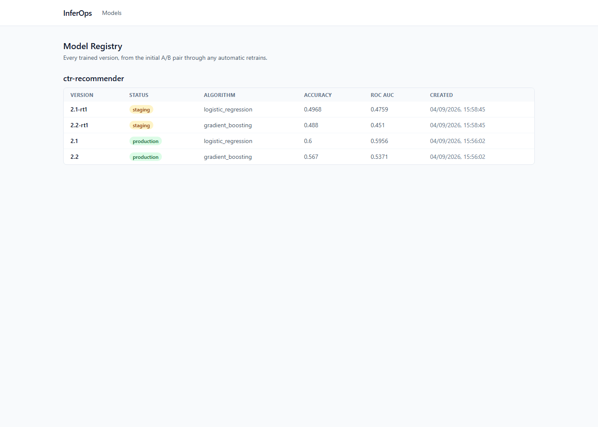
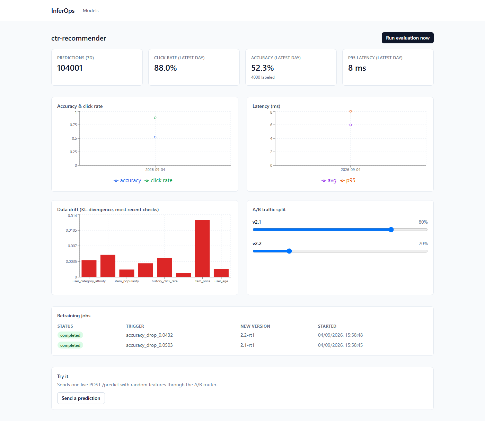

# InferOps

An ML model serving platform: A/B-tested inference between two model versions, Redis result
caching, a Kafka event pipeline, KL-divergence data drift detection, and automatic retraining
triggered by real accuracy regression - not simulated, actually measured from delayed feedback
the same way a production recommendation system would receive it.

```
Client
  |
  v
FastAPI (api)
  |-- Redis: result cache (hash of model + features -> cached prediction, TTL 5m)
  |-- A/B router: weighted-random pick across active deployments by traffic_split
  |-- In-process model runtime: loads joblib artifacts from a shared volume
  |     (registry metadata + artifact path come from Postgres `models`, not a live MLflow
  |      call on the hot path - MLflow stays an experiment/registry system of record)
  \-- Kafka producer: fire-and-forget publish of every inference event
       |
       v
  Kafka topic `inference-events`
       |
       v
  consumer service: micro-batches events, bulk-inserts into `inferences`
       (partitioned by inference_date, idempotent against Kafka's at-least-once redelivery)
       |
       v
  Postgres: models / deployments / inferences / data_drift_metrics / retraining_jobs

  evaluator service (own container, runs on a timer + on-demand via POST /evaluate):
    - accuracy check: inferences with actual_output filled via POST /feedback
      (the only path ground truth ever enters the system)
    - drift check: KL-divergence of live feature distributions vs. each model's
      training-time baseline histogram
    - retraining trigger: accuracy drop > 2% -> retrains on accumulated feedback,
      registers a new staged version in MLflow + Postgres

  Prometheus <- api /metrics + evaluator's own /metrics (separate process, separate registry)
  Grafana <- Prometheus (provisioned dashboard)
  React dashboard <- api's own JSON metrics endpoints (not scraped from Prometheus)
```

## Why this project

Built as a portfolio piece demonstrating the actual mechanics of an MLOps serving platform -
not a toy `/predict` endpoint, but A/B traffic splitting with real weighted routing, a Kafka
event pipeline with idempotent consumption, drift detection with real KL-divergence math, and
a retraining loop that's driven by measured accuracy regression on live-labeled data rather
than a canned demo. See "Design Decisions & Trade-offs" below for where and why this deviates
from the source PRD's literal spec.

## Stack

| Layer | Choice |
|---|---|
| API | FastAPI (Python 3.11) |
| Database | PostgreSQL 16, `inferences` table range-partitioned by date |
| Cache | Redis (result cache) |
| Event bus | Apache Kafka (KRaft mode, single broker, no Zookeeper) |
| Models | scikit-learn (LogisticRegression v2.1, GradientBoostingClassifier v2.2) |
| Experiment tracking / registry | MLflow |
| Monitoring | Prometheus + Grafana |
| Frontend | React + TypeScript + Vite + Tailwind + Recharts |
| Migrations | Alembic (hand-written SQL for the partitioned table) |
| Tests | pytest (unit + integration against real Postgres/Redis/Kafka) |
| CI | GitHub Actions (lint, test, build) |

## Quickstart (Docker)

```bash
cp .env.example .env
docker compose up --build
```

- API: http://localhost:8010 (docs at `/docs`)
- Frontend: http://localhost:5183
- MLflow: http://localhost:5050
- Prometheus: http://localhost:9091
- Grafana: http://localhost:3001 (anonymous viewer access enabled; admin/admin for editing)
- Postgres: localhost:5442, Redis: localhost:6390, Kafka: localhost:9095

Nothing is registered yet on first boot - seed it:

```bash
cd backend && python -m venv .venv && .venv/Scripts/activate  # or source .venv/bin/activate
pip install -r requirements-dev.txt
cd ..
python scripts/generate_dataset.py   # synthetic click-through dataset -> data/
python scripts/train_model.py        # trains + registers Model A (2.1) and Model B (2.2), 80/20 split
python scripts/seed_traffic.py       # normal + drifted traffic waves, delayed feedback, evaluation
python scripts/load_test_batch.py    # 100K-row batch-predict throughput
```

Then open http://localhost:5183 to see the registry, live A/B split, accuracy/latency/drift
charts, and retraining job history:




## API reference

| Endpoint | Description |
|---|---|
| `POST /api/v1/predict` | Score one request; routes across active deployments by traffic_split, cached in Redis |
| `POST /api/v1/batch-predict` | CSV upload, vectorized scoring, returns summary + throughput |
| `POST /api/v1/feedback` | Records delayed ground truth for a past `inference_id` |
| `GET /api/v1/models` | List all registered model versions |
| `GET /api/v1/models/{name}` | List versions for one model name |
| `GET /api/v1/models/{name}/metrics` | Daily accuracy/latency/click-rate, drift history, deployments, retraining jobs |
| `POST /api/v1/models/{name}/evaluate` | Runs the drift/accuracy/retraining checks on demand |
| `GET /api/v1/deployments` | List A/B deployments |
| `POST /api/v1/deployments` | Create a new deployment (A/B variant) |
| `PATCH /api/v1/deployments/{id}` | Update traffic_split / is_active |

Full interactive docs at `/docs` once the api service is running.

## Design Decisions & Trade-offs

The source PRD sketches this system in Go with a generic `recommendation-model` example. Where
this implementation deviates and why:

- **Python/FastAPI, not Go.** This is an ML-engineering project (drift math, model training,
  scikit-learn pipelines) where Python is idiomatic; our standing default stack is Python
  unless the domain points elsewhere, and here it clearly doesn't.
- **A fixed, validated feature schema, not freeform `user_id`/`item_id`/`history`.** A real
  model needs a stable input contract. The PRD's example implies a feature-store lookup keyed
  by IDs; building that join service was out of scope, so `/predict` takes the engineered
  features directly. Redis is still used exactly as specified - the result/feature cache in
  front of inference.
- **Kafka is real** (KRaft mode, no Zookeeper), per explicit choice over writing directly to
  Postgres from the API - the stronger "operated a real event pipeline" story was worth the
  extra service. The consumer's bulk insert is `ON CONFLICT DO NOTHING`, since Kafka only
  guarantees at-least-once delivery and a redelivered batch must not corrupt the whole insert.
- **MLflow stays off the hot path.** The api service reads `artifact_path` from Postgres and
  loads the joblib file straight off a shared volume; it never calls the MLflow tracking server
  per request. MLflow is the experiment/registry system of record, kept in sync by the
  training/retraining code, exactly as a real serving platform would separate these concerns.
- **`inferences` is a genuinely partitioned table** (`PARTITION BY RANGE (inference_date)`,
  hand-written in the Alembic migration since SQLAlchemy's autogenerate doesn't model
  partitions well), with a `DEFAULT` partition as a safety net and an idempotent
  partition-maintenance routine that keeps a few days ahead.
- **The retraining loop is honest, not scripted.** The synthetic dataset's true label function
  (`app/ml/label_fn.py`) is never imported by the serving path - the running system only ever
  learns ground truth through `POST /feedback`, the same delayed-labeling path a real
  recommendation system uses. `scripts/seed_traffic.py` demonstrates this by sending a second
  "drifted" wave of traffic (a real distribution/concept shift the models were never trained
  on) and showing the resulting accuracy drop and retraining trigger with real numbers - see
  below.
- **Batch predict takes a CSV upload, not a giant JSON array** - realistic for 100K+ rows;
  responses are a summary (rows, click rate, throughput), with per-row events still flowing
  through the same Kafka -> consumer -> Postgres pipeline as online predictions.
- **No auth.** Out of scope for a portfolio demo; a real deployment would sit behind an API
  gateway with key auth in front of this.

## Real numbers

All measured on this stack via `docker compose up` + `scripts/train_model.py` +
`scripts/seed_traffic.py` + `scripts/load_test_batch.py` - nothing here is estimated.

**Initial training** (5,000 synthetic rows, 80/20 train/test split):

| Version | Algorithm | Accuracy | ROC AUC |
|---|---|---|---|
| 2.1 | LogisticRegression | 0.600 | 0.596 |
| 2.2 | GradientBoostingClassifier | 0.567 | 0.537 |

Modest numbers by design - the synthetic label function (`app/ml/label_fn.py`) adds
meaningful noise on top of real signal, so a well-generalizing model tops out around 60%, not
95%+. Click-through rate on the non-drifted holdout was 58.0%; on the drifted holdout, 43.3% -
a real, sizeable shift, not a cosmetic tweak.

**Latency & throughput** (from live `/metrics`, seeded with ~104K real predictions):

- Average prediction latency: ~6ms, p95: ~8ms - well inside the PRD's "P99 < 100ms" target.
- Batch predict: 100,000 rows in 118.6s server-side (**843 rows/sec**), 121.2s wall-clock
  including the HTTP upload (**825 rows/sec**) - using plain LogisticRegression/GradientBoosting
  inference, no batching tricks beyond vectorized `predict_proba` over the whole CSV.

**Drift detection**: after the drifted traffic wave, `item_price`'s KL-divergence against its
training-time baseline was ~0.013 - the clear standout among the eight tracked features,
correctly identifying the one feature `label_fn.py` deliberately reweights under `drift=True`.

**Automatic retraining - and an honest limitation**: the evaluator's background loop (no manual
trigger) detected a >2% accuracy drop on *both* the normal and drifted traffic waves and
retrained both model versions within about a minute of the regression appearing in labeled
feedback (`accuracy_drop_0.0503` for v2.1, `accuracy_drop_0.0432` for v2.2 - both auditable in
the `retraining_jobs` table and the dashboard). That the *normal* wave also crossed the 2%
threshold is a real characteristic of this demo's data scale, not a bug: with only ~1,000 holdout
rows backing each baseline accuracy figure, the standard error on that estimate is large enough
that a fresh batch of even non-drifted traffic can land a few points away from it. A production
system would size `accuracy_drop_threshold` against a confidence interval on the baseline (or
require the drop to persist across multiple evaluation windows) rather than a bare point
threshold - noted here rather than tuned away, since the goal was to show the mechanism working
on real measurements, not to stage a cleaner-looking number.

## Tests

```bash
cd backend
pytest                      # unit tests always run; integration tests skip if Postgres/Redis/Kafka aren't reachable
ruff check .
```

CI (`.github/workflows/ci.yml`) runs the full suite against real Postgres/Redis/Kafka service
containers - integration tests are never mocked against these three.
